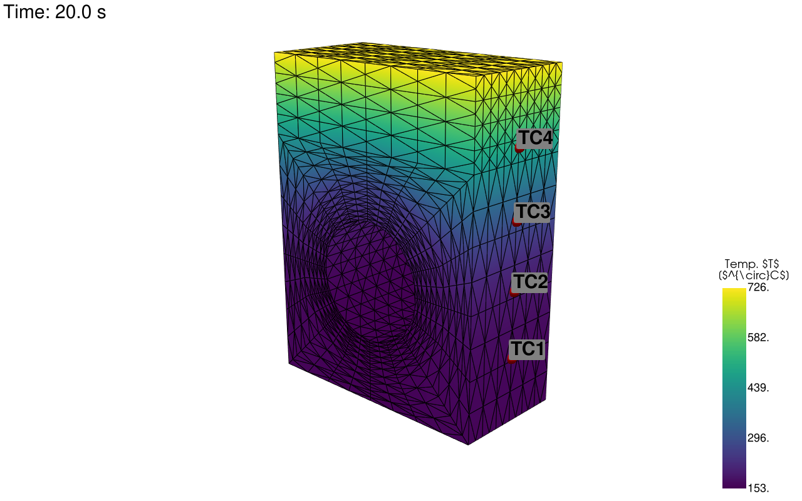
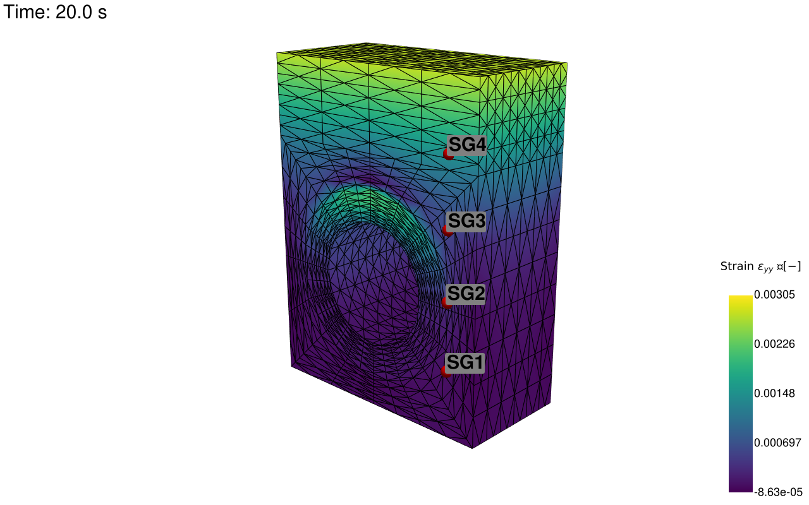
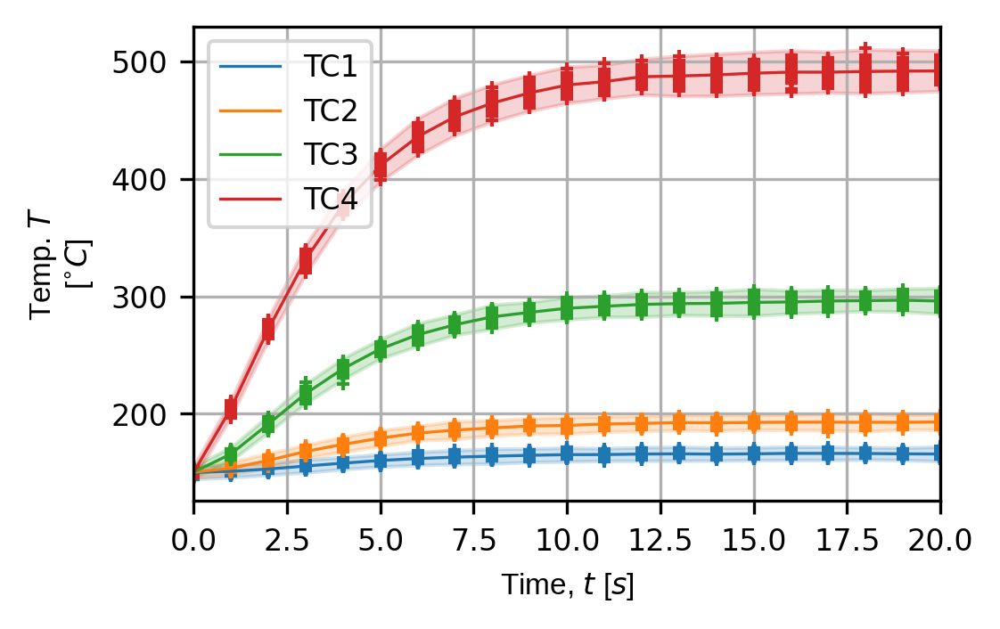
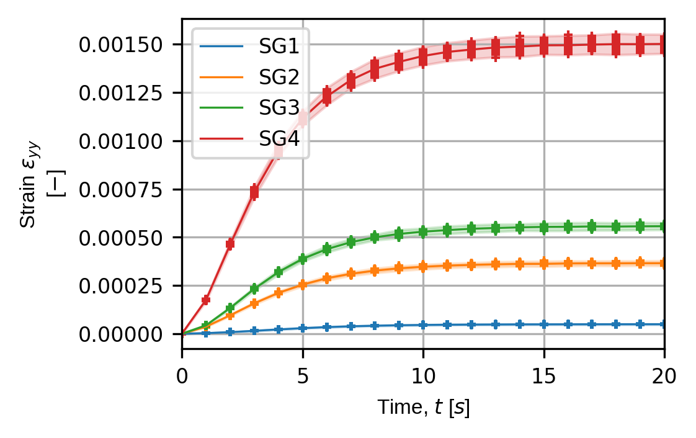

# pyvale
The python validation engine (`pyvale`): An all-in-one package for sensor simulation, sensor uncertainty quantification, sensor placement optimisation and simulation calibration/validation.​ Used to simulate experimental data from an input multi-physics simulation by explicitly modelling sensors with realistic uncertainties. Useful for experimental design, sensor placement optimisation, testing simulation validation metrics and virtually testing digital shadows/twins.

## Quick Demo: Simulating Point Sensors
Here we demonstrate how `pyvale` can be used to simulate thermocouples and strain gauges applied to a [MOOSE](https://mooseframework.inl.gov/index.html) thermo-mechanical simulation of a fusion divertor armour heatsink. The figures below show visualisations of the virtual thermocouple and strain gauge locations on the simualtion mesh as well as time traces for each sensor over a series of simulated experiments. The code to run the simulated experiments and produce the output shown here comes from [this example](https://github.com/Computer-Aided-Validation-Laboratory/pyvale/blob/main/src/pyvale/examples/ex6_2_multiphysics3d_expsim.py).

|||
|--|--|
|*Visualisation of the thermcouple locations.*|*Visualisation of the strain gauge locations.*|

|||
|--|--|
|*Thermocouples time traces over a series of simulated experiments.*|*Strain gauge time traces over a series of simulated experiments.*|


## Installation: Ubuntu
### Managing Python Versions

To be compatible with `bpy` (the Blender python interface), `pyvale` uses python 3.11. To install python 3.11 without corrupting your operating systems python installation first add the deadsnakes repository to apt:
```shell
sudo add-apt-repository ppa:deadsnakes/ppa
sudo apt update && sudo apt upgrade -y
```

Install python 3.11:
```shell
sudo apt install python3.11
```

Add `venv` to your python 3.11 install:
```shell
sudo apt install python3.11-venv
```

Check your python 3.11 install is working using the following command which should open an interactive python interpreter:
```shell
python3.11
```

### Virtual Environment

We recommend installing `pyvale` in a virtual environment using `venv` or `pyvale` can be installed into an existing environment of your choice. To create a specific virtual environment for `pyvale` navigate to the directory you want to install the environment and use:

```shell
python3.11 -m venv .pyvale-env
source .pyvale-env/bin/activate
```

### Standard & Developer Installation

Clone `pyvale` to your local system along with submodules using

```
git clone --recurse-submodules git@github.com:Computer-Aided-Validation-Laboratory/pyvale.git
```

`cd` to the root directory of `pyvale`. Ensure you virtual environment is activated and run the following commmand from the `pyvale` directory:

```
pip install .
pip install ./dependencies/mooseherder
```

To create an editable/developer installation of `pyvale` and `mooseherder` - follow the instructions for a standard installation but run:

```
pip install -e .
pip install -e ./dependencies/mooseherder
```

### MOOSE
`pyvale` come pre-packaged with example `moose` physics simulation outputs (as *.e exodus files) to demonstrate its functionality. If you need to run additional simulation cases we recommend `proteus` (https://github.com/aurora-multiphysics/proteus) which has build scripts for common linux distributions.

## Getting Started
The examples folder in "src/pyvale/examples" includes a sequence of examples of increasing complexity that demonstrate the functionality of `pyvale`.

## Contributors
The Computer Aided Validation Team at UKAEA:
- Lloyd Fletcher (ScepticalRabbit), UK Atomic Energy Authority
- John Charlton, UK Atomic Energy Authority
- Joel Hirst, UK Atomic Energy Authority
- Lorna Sibson, UK Atomic Energy Authority
- Adel Tayeb, UK Atomic Energy Authority
- Alex Marsh, UK Atomic Energy Authority
- Rory Spencer, UK Atomic Energy Authority
- Michael Atkinson, UK Atomic Energy Authority


