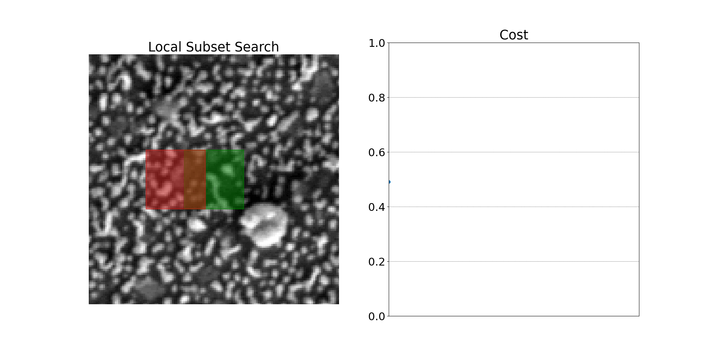
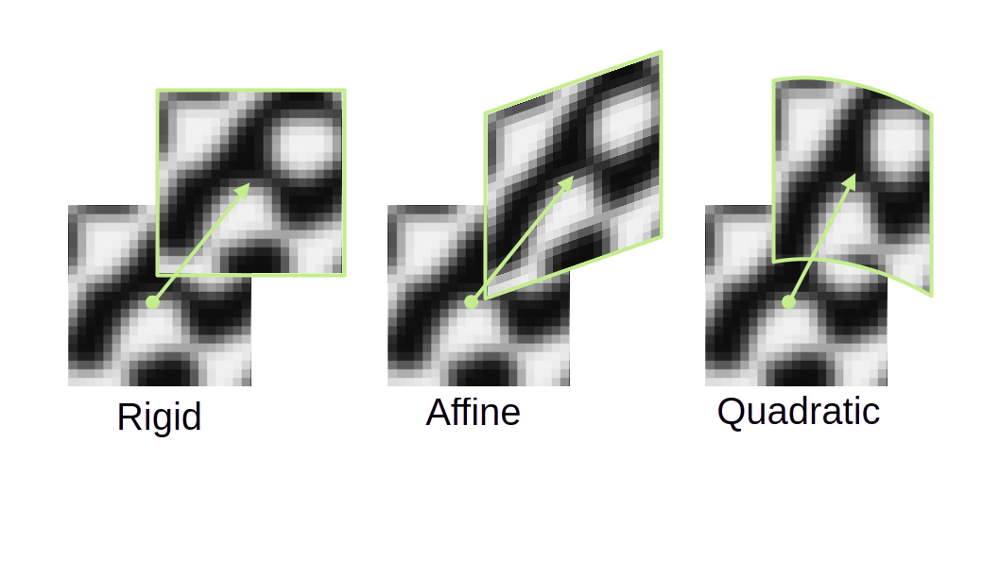
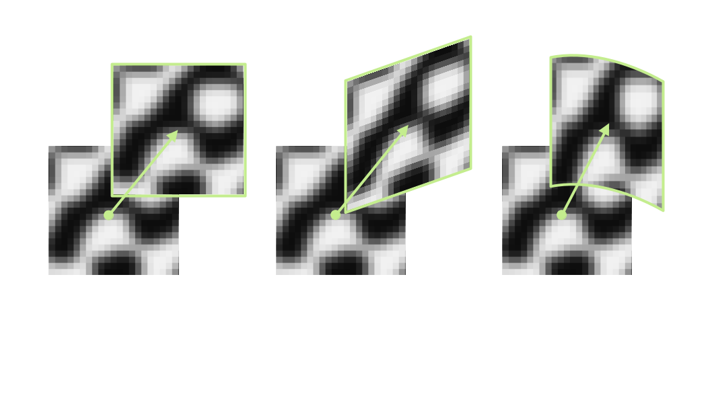
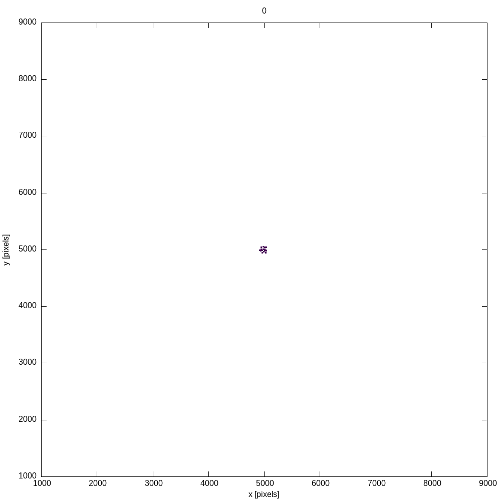

.. _guide_theory_dic:

DIC Theory Overview
======================================

Digital Image Correlation (DIC) is a technique for measuring
deformation, displacement, and strain fields by analyzing a sequence of images captured
during a loading process. At its core, DIC tracks the movement of patterns and textures between images, 
and from this motion, deduces how the material has deformed.

Local Subset DIC
----------------
In Local subset DIC, images are divided into small :math:`N \times N` pixel regions which are called *subsets*.
By comparing the intensity patterns of these subsets across images, we can estimate
their displacement. The image below shows the difference (or cost), where 0 is a perfect match,
for a brute force scan along the x-axis. 

Typically we don't use a brute-force approach, but instead use an **optimization algorithm** that is much more computationally
efficient. The optimization attempts to minimize the difference between the
reference and deformed subset by using the gradient. You can see from the
brute-force approach that there are local minima where the optimizer might get
stuck, so it's important to ensure that any initial guess is reasonably
close to the actual parameters that define the mapping from the subset in the
reference image to the subset in the deformed image.

Shape Functions
---------------
It's often the case that a subset undergoes more complex deformation than just rigid translation between reference and deformed image.
To model how a subset deforms more generally, we introduce *shape functions*. These are
mathematical mappings that describe how points inside a subset move relative to
each other. Pyvale supports three commonly used shape functions in DIC. The simplest of course is a pure *rigid* translation (two
parameters: horizontal and vertical shift). After this comes *affine* and
*quadratic* shape functions:

.. math::
  \xi(x_i,y_i, \mathbf{p}) =
  \underbrace{\begin{bmatrix} p_0 \\ p_1 \end{bmatrix}}_{\text{rigid}}
  + \underbrace{\begin{bmatrix} 1+p_2 & p_3 \\ p_4 & 1+p_5 \end{bmatrix} 
  \begin{bmatrix} x_i \\ y_i \end{bmatrix}}_{\text{affine}} + \underbrace{\begin{bmatrix} p_6 & p_7 & p_8 \\ p_9 & p_{10} & p_{11} \end{bmatrix} 
  \begin{bmatrix} x_i^2 \\ x_iy_i \\ y_i^2 \end{bmatrix}}_{\text{quadratic}}

Each higher-order shape function includes all terms from the lower-order functions: affine includes rigid terms, and quadratic includes both affine and rigid terms.

Cost Functions / Correlation Criterion
---------------------------------------
How do we decide if two subsets *match*? To do this we use what's known as a cost function, or often referred to as a Correlation Criterion.
This is a numerical measure of similarity between the reference subset and the deformed
subset. **Pyvale supports three choices:**

SSD
^^^^

.. math::
  C_{\text{SSD}} = \sum_i \big(f(x_{i},y_{i}) - g(x_{i},y_{i})\big)^{2}

NSSD
^^^^^

.. math::
  C_{\text{NSSD}} = \sum_i \left( \frac{f(x_{i},y_{i})}{\sqrt{\sum_{j} f(x_{j},y_{j})^{2}}} - \frac{g(x_{i},y_{i})}{\sqrt{\sum_{j} g(x_{j},y_{j})^{2}}} \right)^{2}

ZNSSD
^^^^^^

.. math::
  \text{ZNSSD} = \sum_i \left( \frac{\bar{f}(x_{i},y_{i})}{\sqrt{\sum_{j} \bar{f}(x_{j},y_{j})^{2}}} - \frac{\bar{g}(x_{i},y_{i})}{\sqrt{\sum_{j} \bar{g}(x_{j},y_{j})^{2}}} \right)^{2}

where :math:`f(x_{i},y_{i})` and  :math:`g(x_{i},y_{i})` represent the gray-level intensity values at location :math:`(x_{i},y_{i})` in the reference and deformed images.
:math:`\bar{f}(x_{i},y_{i}) = f(x_{i},y_{i}) - f_m`, and :math:`f_m` is the mean gray-level value of the subset. 

Cost Function Optimization
----------------------------
Minimizing the value of the cost function requires using an optimization routine. 
These algorithms start with an initial guess and refine it step by step. Convergence depends on a good
initial guess and a generally well-behaved cost surface. 
Pyvale uses a **Levenberg-Marquardt** non-linear optimization routine to minimize the cost function.
The algorithm proceeds iteratively by updating the shape-function parameter
vector :math:`\mathbf{p}`. At iteration :math:`i`, the parameters are updated according to

.. math::

   \mathbf{p}_{i+1}
   = \mathbf{p}_{i}
     - \left( \mathbf{H} + \lambda\,\mathrm{diag}\!\left[\mathbf{H}\right] \right)^{-1}
       \nabla C(\mathbf{p}_{i}),

where :math:`\nabla C(\mathbf{p}_{i})` denotes the gradient of the cost function
evaluated at the current parameters. The matrix :math:`\mathbf{H}` is an
approximation to the Hessian, taken here as
:math:`\mathbf{H} \approx \mathbf{J}\mathbf{J}^{\mathsf{T}}`, with
:math:`\mathbf{J}` the Jacobian of the residuals with respect to
:math:`\mathbf{p}`. The scalar :math:`\lambda > 0` is the
Levenberg–Marquardt damping factor, which controls the balance between
gradient-descent and Gauss–Newton behavior.

After computing the updated parameter vector :math:`\mathbf{p}_{i+1}`, the cost
function is re-evaluated to assess the quality of the update. Based on the
resulting change in error, the damping parameter :math:`\lambda` is adjusted. 
If the cost **increases**, don't update the shape function parameters and
**increase** the damping by a factor of 10. 
If the cost **decreases**, the update is accepted and the damping is **reduced** by a factor of 10.
This update–evaluation–adjustment cycle is repeated until convergence criteria
based on both parameter change and cost-function reduction are satisfied. The
magnitude of the parameter update is quantified by

.. math::

   \text{d}p_{\text{norm}}
     = \sqrt{\langle \Delta\mathbf{p}, \Delta\mathbf{p} \rangle},
   \qquad
   p_{\text{norm}}
     = \sqrt{\langle \mathbf{p}, \mathbf{p} \rangle},

where :math:`\Delta\mathbf{p} = \mathbf{p}_{i+1} - \mathbf{p}_{i}`, and
:math:`\langle \cdot,\cdot \rangle` denotes the Euclidean inner product. From
these quantities, the relative parameter-update tolerance is defined as

.. math::

   x_{\text{tol}}
     = \frac{\text{d}p_{\text{norm}}}{p_{\text{norm}} + \varepsilon},

with :math:`\varepsilon` a small regularizing constant included to avoid division
by zero. Convergence in terms of the cost function is measured using

.. math::

   f_{\text{tol}}
     = \frac{\lvert C_{i+1} - C_{i} \rvert}{\lvert C_{i} \rvert + \varepsilon}.

Iteration terminates once both :math:`x_{\text{tol}}` and
:math:`f_{\text{tol}}` fall below user-specified thresholds, indicating that
further updates would produce only negligible changes in the parameters and the
cost function.

Sub-pixel Accuracy With Interpolation
--------------------------------------

DIC aims for precision beyond the integer values defined by the image's pixel grid. Integer-pixel
matching is a good start, but physical displacements do not perfectly map to pixel
boundaries. To capture this, we refine the measurement to *sub-pixel*
accuracy using interpolation. Instead of treating the image as a discrete
array, we approximate it as a smooth surface. This is done using **cubic B-spline
interpolation**.

Cubic B-spline Interpolation
^^^^^^^^^^^^^^^^^^^^^^^^^^^^

Cubic B-spline interpolation represents the interpolated function as a weighted sum of shifted B-spline basis functions:

.. math::
    f(x,y) = \sum_{i,j} c_{i,j} \, \beta^3(x - i) \, \beta^3(y - j)

where :math:`c_{i,j}` are B-spline coefficients and :math:`\beta^3(t)` is the cubic B-spline basis function:

.. math::

   \beta^3(t) = \frac{1}{6} \begin{cases}
   (2 - |t|)^3 & \text{if } 1 \leq |t| < 2 \\
   4 - 6t^2 + 3|t|^3 & \text{if } |t| < 1 \\
   0 & \text{if } |t| \geq 2
   \end{cases}

Prefiltering
^^^^^^^^^^^^^^^^^^
To ensure that the B-spline interpolation passes through the original intensity values, we
can apply a filter to get the B-spline coefficients. 
For a 1D row of intensity data :math:`\{f_0, f_1, \ldots, f_{N-1}\}`, the filtering has three steps.
First is to apply a normalization:

.. math::
    c_i^{(0)} = (1-z)(1-1/z) f_i

with pole :math:`z = \sqrt{3} - 2`. Then apply a **causal filter**:

.. math::
   c_i^{(+)} = c_i^{(0)} + z \, c_{i-1}^{(+)}, \quad i = 1, 2, \ldots, N-1

with an initial condition of :math:`c_0^{(+)} = c_0^{(0)}`. The final step is
to apply an **anticausal filter**. Starting at the end of the row:

.. math::
    c_{N-1} = \frac{z}{z^2-1} c_{N-1}^{(+)}

and then applying:

.. math::
    c_i = z(c_{i+1} - c_i^{(+)}), \quad i = N-2, N-3, \ldots, 0

This 1D filtering can be done for each row of the image to get a list of coefficients :math:`c_{i,j}^{(x)}`. It can then be applied to the columns of the result to
get a full list of coefficients :math:`c_{i,j}`.

Evaluation
^^^^^^^^^^
To get the intensity value at an arbitrary subpixel location :math:`f(x,y)` we
compute the local coordinates:

.. math::

    t_x = x - \mathrm{floor}(x), \quad t_y = y - \mathrm{floor}(y)

then evaluate the basis functions for the local coordinates:

.. math::
    B_0(t) &= (1-t)^3/6 \\
    B_1(t) &= (3t^3 - 6t^2 + 4)/6 \\
    B_2(t) &= (-3t^3 + 3t^2 + 3t + 1)/6 \\
    B_3(t) &= t^3/6

and compute the interpolated value:

.. math::

    f(x,y) = \sum_{k=0}^{3} \sum_{\ell=0}^{3} c_{i_x+k-1, i_y+\ell-1} \, B_k(t_x) \, B_\ell(t_y)

 
.. list-table::
   :width: 85%
   :class: borderless

   * - .. figure:: guide_theory_dic_preinterp.png
          :width: 100%

     - .. figure:: guide_theory_dic_interp.png
          :width: 100%

Reliability-Guided DIC (RG-DIC)
--------------------------------
It's highly likely that some subsets will poorly correlate due to texture changes, cracks, noise, changes in lighting, or large local deformations.
Reliability-Guided DIC (RG-DIC) was a method developed by `B. Pan (2009) <https://opg.optica.org/ao/abstract.cfm?uri=ao-48-8-1535>`_ that helps to limit 
the amount of poor results by correlating subsets in an order determined by the magnitude of the correlation coefficient.
The algorithm proceeds as follows:

#. The user selects an initial seed location. Correlation is performed at the
   seed location and its 4 neighboring points. These points are marked as computed
   in a global mask.
#. The four points are added to a queue ordered from highest correlation
   coefficient to lowest.
#. The point at the top of the queue is removed. Correlation is then performed
   for its uncomputed neighbors. Successful correlations from previously computed neighboring subsets
   are used as initial conditions for the optimization routine.
#. Newly computed points are updated in the global mask and added to the queue.
#. The algorithm then expands outward in a front-propagation style until all 
   subsets have been computed.

Strain Calculations & Formulations
-----------------------------------
The in-plane strain components can be calculated using the spatial derivatives of the displacement field to capture local changes in geometry. 
The 2D deformation gradient matrix, :math:`\mathbf{F}`, is given by:

.. math::

   \mathbf{F} =
   \begin{bmatrix}
     1+\dfrac{\partial u_x}{\partial x} & \dfrac{\partial u_x}{\partial y} \\
     \dfrac{\partial u_y}{\partial x} & 1+\dfrac{\partial u_y}{\partial y}
   \end{bmatrix}
   = \mathbf{I} + \nabla \boldsymbol{u},
   \qquad
   \boldsymbol{u} =
   \begin{bmatrix}
     u_x \\ u_y
   \end{bmatrix}.

To calculate the partial derivatives above, we compute the gradient over a square window containing :math:`N \times N` displacement data points from the DIC calculation. 
Because we are using displacement values from DIC, the strain window is dependent on the subset-step, :math:`s`, and subset-size, :math:`w`. 
These quantities, along with the size of the strain window, form what is typically referred to as the Virtual Strain Gauge, :math:`VSG`:

.. math::

   VSG = (\mathrm{N} - 1)s + w

Due to the noise in DIC measurements, smoothing is typically applied over the strain window. 
We support bilinear and biquadratic smoothing over the strain window elements. 
The polynomial approximation is given by:

.. math::

   \boldsymbol{u}(x,y) = \mathbf{P}(x,y)\,\mathbf{c},

where :math:`\boldsymbol{u} = [\,u_x\;u_y\,]^{T}`, :math:`\mathbf{P}(x,y)` is a row vector of basis terms, and :math:`\mathbf{c}` is a column vector of coefficients. The polynomial basis is:

.. math::

   \mathbf{P}(x,y) =
   \begin{cases}
     [1, x, y] & \text{bilinear}, \\
     [1, x, y, x^2, y^2, x^2 y, x y^2, x^2 y^2] & \text{biquadratic}
   \end{cases}

The coefficients are obtained by solving a linear least-squares problem, since the displacement field is linearly parameterized in the unknown coefficients. 
Once the polynomial coefficients have been obtained, the deformation gradient tensor and strain can be calculated. We currently support the following strain tensor formulations:

- ``strain_formulation="HENCKY"``, *Hencky (logarithmic)*: :math:`\boldsymbol{\varepsilon}=\ln(\sqrt{\mathbf{F}^\mathsf{T}\mathbf{F}})`
- ``strain_formulation="GREEN"``, *Green–Lagrange*: :math:`\boldsymbol{\varepsilon}=\tfrac{1}{2}\left(\mathbf{F}^\mathsf{T}\mathbf{F}-\mathbf{I}\right)`
- ``strain_formulation="ALMANSI"``, *Euler–Almansi*: :math:`\boldsymbol{\varepsilon}=\tfrac{1}{2}\left(\mathbf{I}-(\mathbf{F}\mathbf{F}^\mathsf{T})^{-1}\right)`
- ``strain_formulation="BIOT_LAGRANGE"``, *Biot (right / Lagrangian)*: :math:`\boldsymbol{\varepsilon}=\sqrt{\mathbf{F}^\mathsf{T}\mathbf{F}}-\mathbf{I}`
- ``strain_formulation="BIOT_EULER"``, *Biot (left / Eulerian)*: :math:`\boldsymbol{\varepsilon}=\sqrt{\mathbf{F}\mathbf{F}^\mathsf{T}}-\mathbf{I}`

where :math:`\mathbf{I}` is the :math:`2 \times 2` identity matrix.
