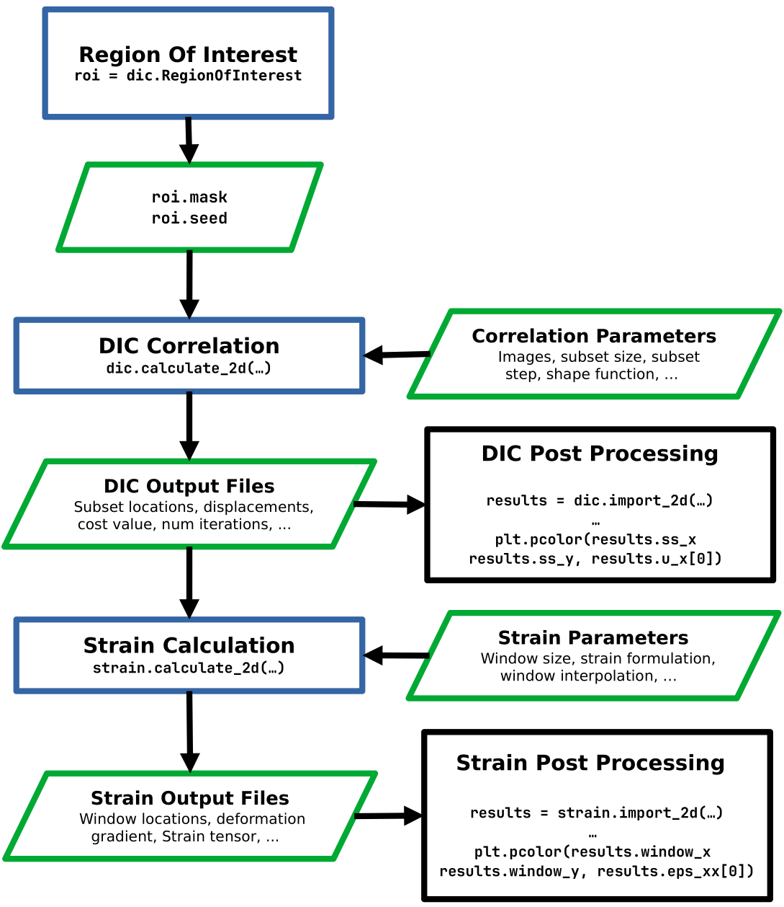

.. _guide_dic:

DIC User Guide
==============

**This page should be conisered a guide to the core DIC user interactions and useful
tips and tricks for getting good results in a reasonable amount of time.
Specific examples can be found in the** :ref:`examples_all` **section**.
**If you are after a runthrough of the mathematics of the DIC engine, you can find
that in the** :ref:`guide_theory_dic`.

Importing the DIC modules
--------------------------

After installing Pyvale, you'll need to importing the relevent modules before
going any further. We like to import the modules in the following way:

.. code-block:: Python

    import pyvale.dic as dic
    import pyvale.strain as strain

The Pyvale DIC workflow
-----------------------

Region Of interest (ROI) Selection
^^^^^^^^^^^^^^^^^^^^^^^^^^^^^^^^^^^^

Basic Selection
""""""""""""""""""

For any DIC calculation the user must first specify the **region of interest
(ROI)** for their calculation. You can either use Pyvale (see the first DIC
example for a detailed walkthrough), or, you can create it using Numpy.
Basic approaches are summarized below:

.. tab-set::

   .. tab-item:: Interactive ROI Pyvale
      

      .. code-block:: python

         roi = dic.RegionOfInterest(ref_image="./ref_img.tiff") # initialization
         roi.interactive_selection(subset_size=31)  # ROI GUI will launch

         dic.calculate_2d(
             ...,
             roi=roi.mask,
             seed=roi.seed,
             ...,
         )

   .. tab-item:: Programmatic ROI Pyvale
      

      .. code-block:: Python

         roi = dic.RegionOfInterest(ref_image="./ref_img.tiff") # initialization
         roi.rect_boundary(left=100,right=100,bottom=100,top=100) # exclude a 100 pixel boundary

         dic.calculate_2d(
             ...,
             roi=roi.mask,
             seed=[500, 500],  # seed at centre of image
             ...,
         )

   .. tab-item:: Programmatic ROI Numpy
      

      .. code-block:: Python

         arr = np.zeros((1000, 1000), dtype=bool)  # image is 1000x1000
         arr[100:900, 100:900] = True  # Exclude a 100 pixel boundary

         dic.calculate_2d(
             ...,
             roi=arr,
             seed=[500, 500],  # seed at centre of image
             ...,
         )

Behind the scenes ``dic.RegionOfInterest`` initializes ``roi.mask`` as a ``np.ndarray`` with
the same dimensions as the reference image. You can then manipulate it as you
would with any 2D Numpy array before passing to the DIC engine. 

Defining a ROI with a YAML file
""""""""""""""""""""""""""""""""""

Another option is to use a YAML file for the ROI. When using
``roi.interactive_selection`` you can save and open ROI configurations easily
within the GUI. In most cases, it will be easier to create and save the ROI YAML using
the GUI and use that for all future calculations. It will also give you a sense
of how the YAML is structured.

Each entry in the YAML file describes a specific ROI object with a specific
type. The ROI shape can be specified with:

* ``RectROI``
* ``CircleROI``
* ``PolyLineROI``

For each ROI shape, you must also specify the Boolean flag ``add`` which
indicates whether the ROI shape is being added (``true``) or subtracted (``false``)
from the mask.

There are shape specific fields:

* ``pos``: For rectangular, circular, and seed ROIs: the top-left or center position as [x, y].
* ``size``: For RectROI and SeedROI: [width, height]. For CircleROI: diameter values (same number repeated).
* ``points``: For ``PolyLineROI`` an ordered list of [x, y] vertices defining the polyline.

The order in which they are defined in the YAML file determines the layering.
The ROI object at the top of the file will be the bottom most layer. Any
later additions or subtractions will be applied to previously defined ROI
objects.

You can also specify the seed location using ``SeedROI``. This requires the same
arguments as ``RectRoi``. Ensure that this has been configured with ``add: true`` and  the width and height 
fields for ``size`` are identical.

An example of an ROI configured in YAML side-by-side with it loaded into the ROI
GUI can be found below:

.. list-table::
   :widths: 50 50
   :align: left

   * - .. container:: code-scroll

         .. code-block:: yaml

          - type: RectROI
            pos:
            - 34
            - 37
            size:
            - 433
            - 588
            add: true
            - type: RectROI
            pos:
            - 322
            - 53
            size:
            - 123
            - 225
            add: false
            - type: CircleROI
            pos:
            - 371
            - 536
            size:
            - 133
            - 133
            add: false
            - type: PolyLineROI
            points:
            - - 158
              - 422
            - - 85
              - 482
            - - 88
              - 584
            - - 222
              - 586
            - - 227
              - 480
            add: false
            - type: SeedROI
            pos:
            - 108
            - 145
            size:
            - 41
            - 41
            add: true

     - .. image:: ./guide_dic_interactive.png
          :height: 400px

Performing a correlation
^^^^^^^^^^^^^^^^^^^^^^^^

The next step is to perform a correlation with the ``dic.calculate_2d`` function.
There are a few arguments that **must** be passed. These are the
rference and deformed images, the roi mask and seed, as well as the subset size
and subset step:

.. code-block:: Python

   dic.calculate_2d(
        reference=ref_image, # Can be str | pathlib.Path | np.ndarray
        deformed=def_image,  # Can be str | pathlib.Path | np.ndarray
        roi_mask=roi.mask,   # np.ndarray
        seed=roi.seed,       # pair of intergers. Allowed as list[int] | list[np.int32] | np.ndarray 
        subset_size=31,      # must be an odd number
        subset_step=15
   )

All other possible arguments will have default values. See
the API documentation for this function for more details.

Understanding Output files
^^^^^^^^^^^^^^^^^^^^^^^^^^^

The next step is to understand the output. By default the results will be saved
in the users current working directory in human readable .CSV format with a filename prefix of
``dic_results_`` followed by the name of the deformed image.

For 2D DIC, text output files contain the following columns:

- ``subset_x``:
  X-coordinate of the center of the subset (or window) used in displacement tracking or correlation analysis.

- ``subset_y``:
  Y-coordinate of the center of the subset used in displacement tracking or correlation analysis.

- ``disp_u``:
  Displacement in the X-direction (horizontal) calculated for the subset.

- ``disp_v``:
  Displacement in the Y-direction (vertical) calculated for the subset.

- ``disp_mag``:
  Magnitude of the displacement vector.

- ``converged``:
  Boolean flag indicating whether the displacement calculation algorithm converged for this subset.

- ``cost_zncc``:
  The final value of the cost function used during the displacement calculation.
  The reported value is always given as the ZNCC value no matter if the SSD, NSSD or ZNSSD has been chosen as the correlation function.
  The ZNCC is calculated with the final parameter values from the last optimizer iteration.

- ``ftol``:
  The final value of the function tolerance, a measure of how much the cost function changed between iterations at convergence.

- ``xtol``:
  The final value of the solution tolerance, a measure of how much the solution (displacement) changed between iterations at convergence.

- ``num_iter``:
  The number of iterations the algorithm took to converge for this subset.

For stereo DIC, output files contain the same 2D temporal DIC columns followed
by stereo matching and 3D reconstruction columns. The additional stereo columns are:

- ``stereo_disp_u_px``:
  Horizontal pixel displacement from the left image subset to the corresponding right image subset.

- ``stereo_disp_v_px``:
  Vertical pixel displacement from the left image subset to the corresponding right image subset.

- ``stereo_disp_mag_px``:
  Magnitude of the left-to-right stereo pixel displacement.

- ``stereo_disp_u_mm``:
  Reconstructed X-direction displacement in millimetres in the camera 0 world coordinate system.

- ``stereo_disp_v_mm``:
  Reconstructed Y-direction displacement in millimetres in the camera 0 world coordinate system.

- ``stereo_disp_w_mm``:
  Reconstructed Z-direction displacement in millimetres in the camera 0 world coordinate system.

- ``stereo_x_mm``:
  Reconstructed X-coordinate in millimetres in the camera 0 world coordinate system.

- ``stereo_y_mm``:
  Reconstructed Y-coordinate in millimetres in the camera 0 world coordinate system.

- ``stereo_z_mm``:
  Reconstructed Z-coordinate in millimetres in the camera 0 world coordinate system.

- ``stereo_converged``:
  Boolean flag indicating whether the stereo left-to-right subset match converged.

- ``stereo_cost_zncc``:
  Final ZNCC value for the stereo left-to-right subset match.

- ``stereo_ftol``:
  Final function tolerance value for the stereo optimizer.

- ``stereo_xtol``:
  Final solution tolerance value for the stereo optimizer.

- ``stereo_num_iter``:
  Number of optimizer iterations used by the stereo subset match.

You can alter the path, delimiter and filename prefix of the output file using the arguments
:code:`output_basepath`, :code:`output_delimiter` and :code:`output_prefix`. You
can also opt to save results in binary format. This can be done by setting
:code:`output_binary=True`. Binary 2D DIC files use the ``.dic2d`` extension and
binary stereo DIC files use the ``.dic3d`` extension.

Importing DIC Results
^^^^^^^^^^^^^^^^^^^^^

Once you have finished your correlation, you can proceed with any
visualization and post-processing tools/software. Pyvale does provide 
the capability to read the DIC data using a single command into a
dataclass that can be utilized for simple plotting. Importing data is done with
the ``dic.import_2d`` command. The below highlights how to import data and
create a simple plot of the displacement:

.. code-block:: Python

   import matplotlib.pyplot as plt

   dic_data = dic.import_2d(data="./dic_results_*")

   # plot of vertical displacement for first deformation image.
   plt.pcolor(dic_data.ss_x, 
           dic_data.ss_y, 
           dic_data.u_y[0]) # [image, y, x]

The import will find all files in the current working directory with that
filname prefix. If you have changed :code:`output_delimiter` prior to the
correlation you will also need to specify the delimiter when importing the data.

Strain Calculation
^^^^^^^^^^^^^^^^^^^

The previous step is optional if you are wanting to perform a strain
calculation. If you don't need to do any kind of visualization or analysis, you
can import DIC data and calculate strains using 

.. tab-set::

   .. tab-item:: Embedded DIC data Import

      .. code-block:: python

         strain.calculate_2d(data="./dic_results_*",
            input_delimiter=",",
            window_size=5,
            window_element=9
         )

   .. tab-item:: Prior DIC data Import

      .. code-block:: Python

         dic_data = dic.import_2d(data="./dic_results_*", delimiter=",")

         strain.calculate_2d(
            data=dic_data,
            window_size=5,
            window_element=9
         )

Understanding Strain Output Files
^^^^^^^^^^^^^^^^^^^^^^^^^^^^^^^^^^^^^

Just like the DIC output, the strain output files are saved
in the users current working directory in human readable .CSV format with a filename prefix of
``strain_`` followed by the name of the deformed image. 

**The output will have the following columns:**

* ``window_x``: X-coordinate of the strain window center.
* ``window_y``: Y-coordinate of the strain window center.
* ``def_grad_00``: Deformation gradient component, :math:`F_{00}`.
* ``def_grad_01``: Deformation gradient component, :math:`F_{01}`.
* ``def_grad_10``: Deformation gradient component, :math:`F_{10}`.
* ``def_grad_11``: Deformation gradient component, :math:`F_{11}`.
* ``eps_00``: Strain tensor component :math:`\eps_{00} (normal strain in x-direction).
* ``eps_01``: Strain tensor component :math:`\eps_{01} (shear strain xy).
* ``eps_10``: Strain tensor component :math:`\eps_{10} (shear strain yx).
* ``eps_11``: Strain tensor component :math:`\eps_{11} (normal strain in y-direction).

You can alter the path, delimiter and filename prefix of the output file using the arguments
:code:`output_basepath`, :code:`output_delimiter` and :code:`output_prefix`. You
can also opt to save results in binary format. This can be done by setting
:code:`output_binary=True`.

Importing Strain Data
^^^^^^^^^^^^^^^^^^^^^^^^
Importing Strain data is done with the ``strain.import_2d`` command. 
The below highlights how to import data and
create a simple plot of the normal strain in the x-direction:

.. code-block:: Python

   import matplotlib.pyplot as plt

   strain_data = strain.import_2d(data="./dic_results_*")

   # plot of vertical displacement for first deformation image.
   plt.pcolor(strain_data.window_x, 
              strain_data.window_y, 
              strain_data.eps_xx[0]) # [image, y, x]

The import will find all files in the current working directory with that
filname prefix. If you have changed :code:`output_delimiter` prior to the
correlation you will also need to specify the delimiter when importing the data.

DIC with Large Images/Displacements
------------------------------------

Incremental DIC
^^^^^^^^^^^^^^^^

By default Pyvale performs all temporal DIC calculations against the original
reference image. This is usually the simplest interpretation of the results, but
it can become unreliable when the deformation between the reference image and a
later image is too large for a robust subset match.

Incremental DIC changes the reference image during a sequence:

.. code-block:: Python
   :emphasize-lines: 3-5

   dic.calculate_2d(
        ...,
        incremental=True,
        incremental_update_condition="IMAGE",
        incremental_update_value=1,
        ...,
   )

When ``incremental=True``, Pyvale may replace the active reference image with
the previous deformed image before processing the next frame. This reduces the
image-to-image deformation that the optimizer has to solve. The displacement
values written to disk are still accumulated relative to the first reference
image, so ``disp_u`` and ``disp_v`` remain total temporal displacements rather
than only frame-to-frame increments. The correlation quality fields, such as
``cost_zncc``, ``ftol``, ``xtol`` and ``num_iter``, describe the match against
the active, possibly updated reference image.

The update rule is controlled with ``incremental_update_condition`` and
``incremental_update_value``:

- ``"IMAGE"``:
  Update after every ``N`` deformed images, where ``N`` is
  ``incremental_update_value``. For example, ``incremental_update_value=1``
  updates the reference at every available opportunity after the first deformed
  image.

- ``"ITER"``:
  Update when the average ``num_iter`` value from the previous image is greater
  than ``incremental_update_value``.

- ``"COST"``:
  Update when the average ``cost_zncc`` value from the previous image is greater
  than ``incremental_update_value``.

The first deformed image is always matched against the original reference image.
When the reference is updated, subsets that failed the threshold check in the
previous frame are removed from the active subset set for later frames. For
stereo DIC, the same temporal reference update is applied to the left camera
stream; Pyvale also carries the previous right-camera stereo result as the
updated stereo reference used for reconstructing 3D displacements.

Setting a Maximum Displacement
^^^^^^^^^^^^^^^^^^^^^^^^^^^^^^^

Typically if you are performing DIC with large displacements that will exceed
well above 100 pixels, then there will be a few arguments that you will want to
consider tweaking that might help to improve your results.

Firstly, it's important to chose a max displacement value that is comfortably
larger than your estimate for the final maximum displacement. For example, if
you *think* your max displacement is roughly 300 pixels, then trying a value of
512 (powers of two help with FFT efficiency) would be a sensible option. This
can be done with:

.. code-block:: Python
   :emphasize-lines: 3

   dic.calculate_2d(
        ...,
        max_displacement=512,
        ...,
   )

Pyvale will always round the `max_displacement` value up to the next greatest
power of 2. So if you select 400, it would still round to 512. Again, this is to
benefit from the efficiencies of FFTs.

Enabling Outlier Removal in Multiwindow FFTCC Initialization
^^^^^^^^^^^^^^^^^^^^^^^^^^^^^^^^^^^^^^^^^^^^^^^^^^^^^^^^^^^^^^^^^

The FFTCC multiwindowing approach involves seeding smaller windows with the
rigid estimates from neighbouring points in the previous larger window. This can
sometimes be problematic when multiple windows are involved as incorrect
estimates can be propogated through the smaller windows, leading to a wildly
incorrect initial rigid estimate for the displacements.

Pyvale has an FFT displacement outlier removal filter
that, when enabled, will kill likely incorrect spikes in the rigid
estimates for each FFTCC window size. This can be enabled with the following
arguments when calling the DIC engine:

.. code-block:: Python
   :emphasize-lines: 3-6

   dic.calculate_2d(
        ...,
        fft_filter=True,
        fft_filter_threshold=3.0, # <-- Default value
        fft_filter_radius=3,
        fft_filter_corr_power=2.0,
        ...
   )

The FFT displacement outlier removal works in the following way:

#. Looks at nearby subsets in a 2D neighborhood
#. Computes a correlation-weighted vector median of their shifts
#. Computes a weighted median vector residual
#. A vector is replaced if its normalized residual is larger than the adaptive threshold.
   A larger :code:`fft_filter_threshold` is therefore more *tolerant*, while a smaller value kills larger deviations.

Sequential Image Loading
^^^^^^^^^^^^^^^^^^^^^^^^

When working with a series of large images, RAM usage starts to become an
important consideration. In it's current form, Pyvale will read **all** images
in the workflow when it starts. This isn't a huge problem for typical DIC
workflows where images are typically 10s of MBs, but will start to cause crashes
with high resolution images (100s MBs.). To get around this we'd recommend
**placing the DIC engine call in a loop over the images**. An example of which can be found
below:

.. code-block:: Python

    ref_img = "ref_00.tiff"
    def_imgs = ["def_00.tiff", "def_01.tiff", "def_02.tiff", ...]

    for def_img in def_imgs:
    
        dic.calculate_2d(
            ...,
            reference=ref_img,
            deformed=def_img,
            ...,
         )

There are plans to change this in later pyvale versions so that images
are read sequentially and thus avoiding the need for any loops. Please keep an
eye on the documentation for any future changes.

Selecting a Thread Count
-------------------------------

Pyvale uses `OpenMP <https://www.openmp.org/>`_ for parallel calculations.
Users can select the number of threads used in the DIC calculation with the
:code:`num_threads` argument in :code:`dic.calculate_2d`:

.. code-block:: Python
   :emphasize-lines: 3

   dic.calculate_2d(
       ...,
       num_threads=<int>,
       ...,
    )

Alternatively, those on UNIX operating systems (MacoS, Linux) can set the number
of threads using the :code:`OMP_NUM_THREADS` environment variable.
If you are using Windowos PowerShell you can use the command :code:`$env:OMP_NUM_THREADS=`.
It is worth noting that Pyvale will only use this value if it has not been
specified with the :code:`num_threads=` function argument.
