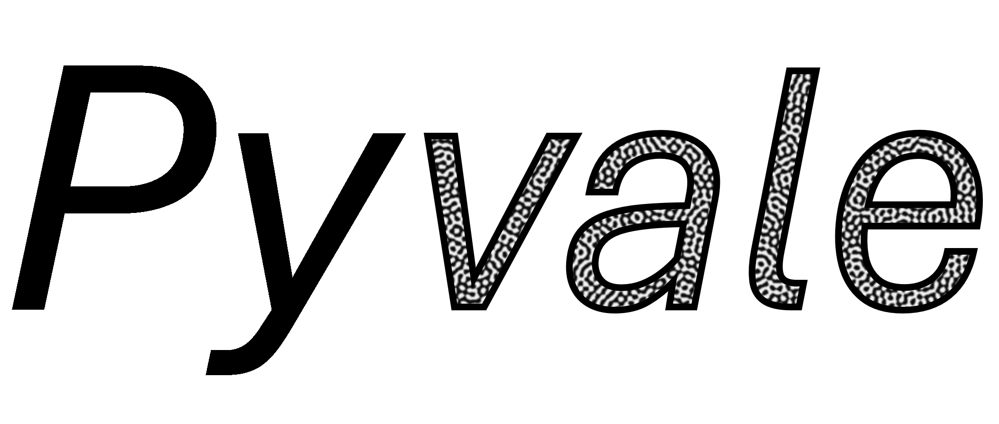

.. pyvale documentation master file, created by
   sphinx-quickstart on Wed Apr  2 13:15:20 2025.
   You can adapt this file completely to your liking, but it should at least
   contain the root `toctree` directive.

======
The python validation engine (pyvale): An all-in-one package for sensor simulation, sensor uncertainty quantification, sensor placement optimisation and simulation calibration/validation.
Used to simulate experimental data from an input multi-physics simulation by explicitly modelling sensors with realistic uncertainties. 
Useful for experimental design, sensor placement optimisation, testing simulation validation metrics and virtually testing digital shadows/twins.

**Useful links:** `Installation <https://github.com/Computer-Aided-Validation-Laboratory/pyvale>`_ | `Source Repository <https://github.com/Computer-Aided-Validation-Laboratory/pyvale>`_ | `Paper <https://github.com/Computer-Aided-Validation-Laboratory/pyvale>`_

.. toctree::
   :maxdepth: 1
   :caption: Contents:

   install
   guide
   example
   api
    

Contributors
------------

The Computer Aided Validation Team at UKAEA:

   #. Lloyd Fletcher (`ScepticalRabbit <https://github.com/ScepticalRabbit>`_), UK Atomic Energy Authority
   #. John Charlton  (`coolmule0 <https://github.com/coolmule0>`_), UK Atomic Energy Authority
   #. Joel Hirst (`JoelPhys <https://github.com/JoelPhys>`_), UK Atomic Energy Authority
   #. Lorna Sibson (`lornasibson <https://github.com/lornasibsin>`_), UK Atomic Energy Authority
   #. Adel Tayeb, UK Atomic Energy Authority
   #. Alex Marsh, UK Atomic Energy Authority
   #. Rory Spencer, UK Atomic Energy Authority
   #. Michael Atkinson, UK Atomic Energy Authority

